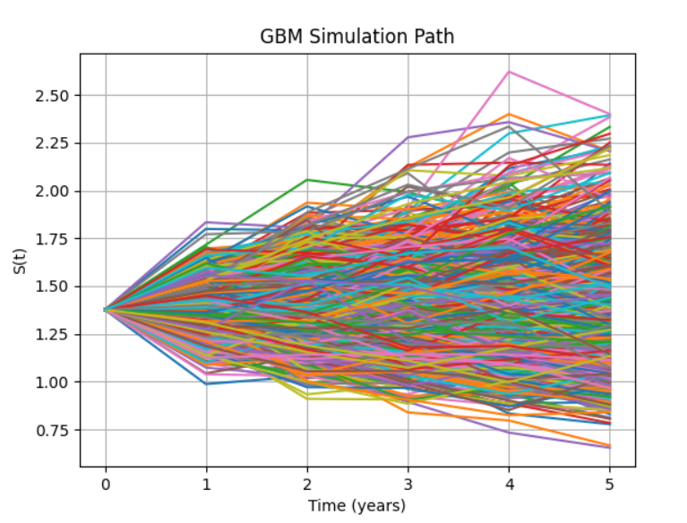
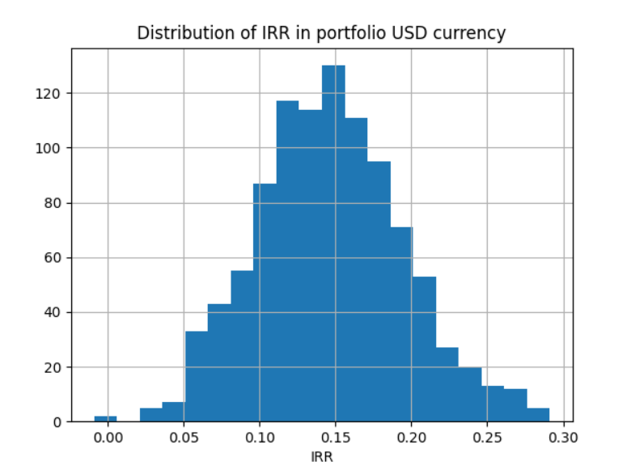
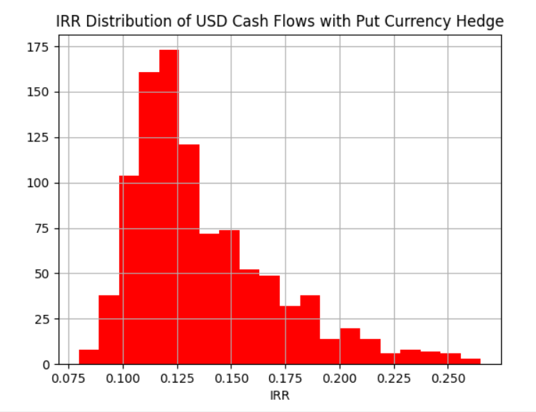
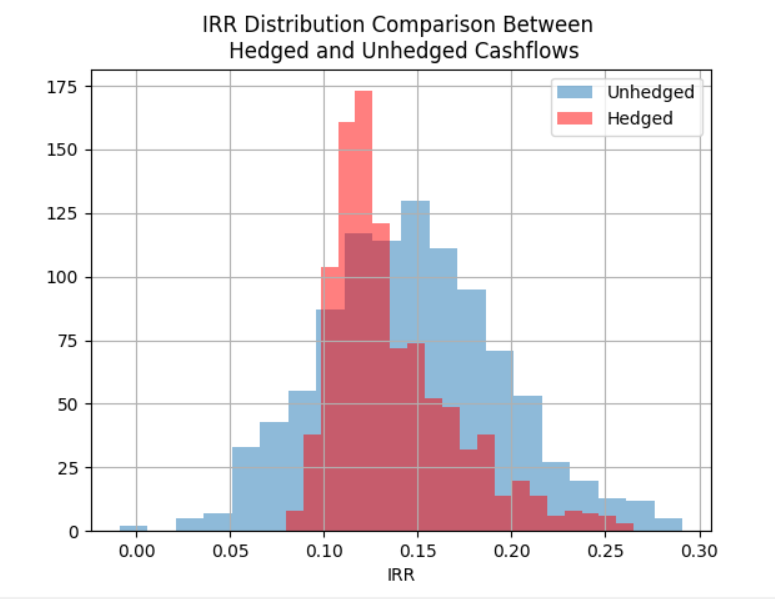

# FX-Cashflow-Hedge
Hedging Cashflows using GBP/USD put options

Parameters:

Trade Date: 31/08/2021

Expiration Date: 31/08/2026

FX rate at t=0: 1.37625

Strike Price: 1.37625

r = 0

volatility = 0.093

Notional amount on Put: £100,000,000 

Simulated GBP/USD price movement over 5-year time span using geometric Brownian motion using 1000 Monte Carlo simulations. 

From this calculated the internal rate of return (IRR) for each simulation in USD currency, taking into account the fluctuations in FX. The distribution of the IRR for each Monte Carlo simulation is depicted below. 

5th percentile IRR:     0.0672

50th percentile IRR:    0.1453

95th percentile IRR:    0.2305

Next, calculating the 5-year put price using the average payoff of all Monte Carlo simulations.

Put price = max(K-S(t) , 0)

Monte Carlo Put Price = 0.1131

Next, using the put price to hedge against the fluctuating GBP/USD rate by purchasing £100,000,000 in puts on the date of the first cash flow to expire on the date of the last cash flow. Next add the put premium payment to the cashflow of the first in the 5-year time span and calculate the payoff for each Monte Carlo simulation and add to the final cash flow that falls on the put expiry date. Finally, recalculate the new IRR distribution with the put hedge. This can be seen below.

5th percentile Hedged IRR:     0.0987

50th percentile Hedged IRR:    0.1272

95th percentile Hedged IRR:    0.2054

Analysis: Comparison of the IRR distributions 

As shown in the figure below, the distribution for the unhedged portfolio is much larger. As also shown in the percentiles it shows the unhedged portfolio can lead to higher returns but can also result in lower returns then the hedged IRR. The hedge mitigates the exchange rate risk to a certain extent, reducing the loss in tail, at the expense of losing the gains in the other tail.

Improvements to the project:

Increase the number of simulations for a more accurate put price. 

Improve the hedge by splitting the put option into differing maturities that conicide with all cashflows. The product of this is a better hedge, meaning greater limiting on the downside and also the upside. 

